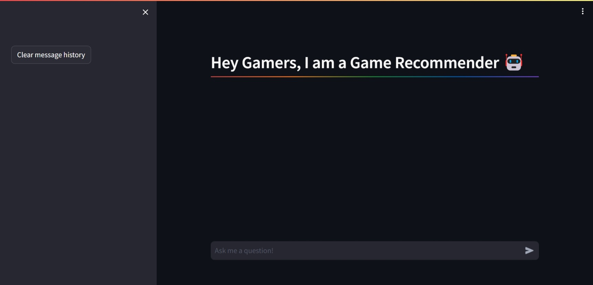
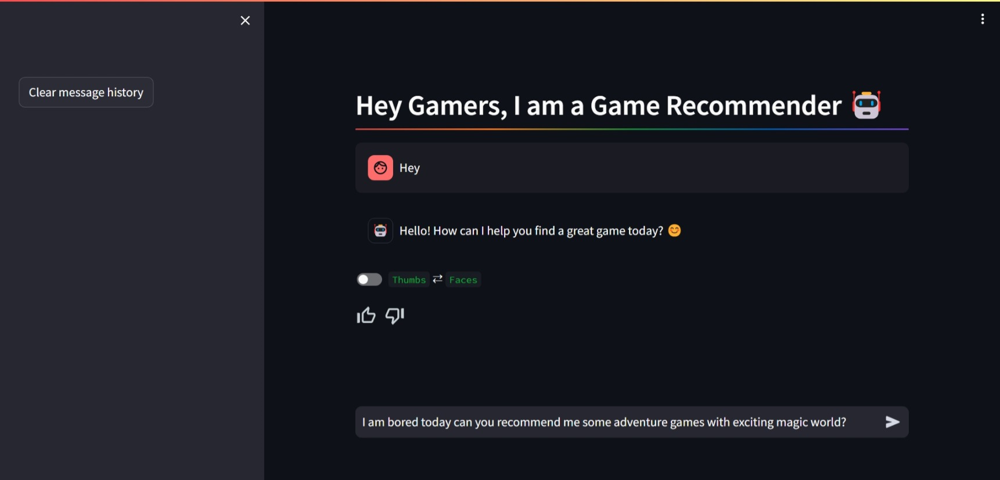
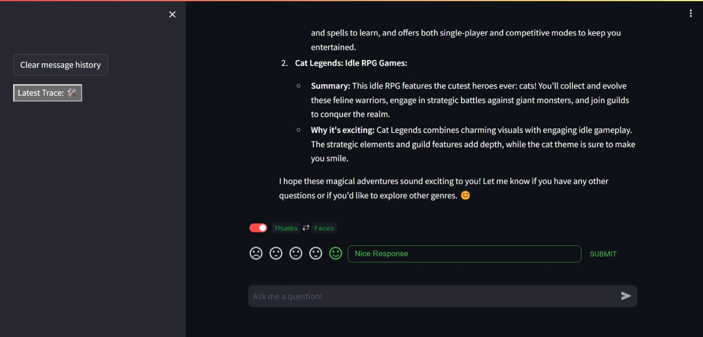
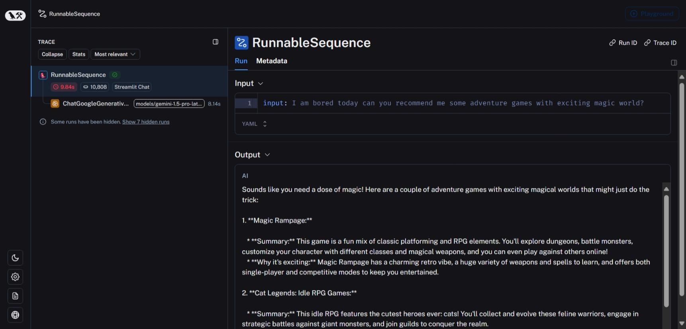

# Game Recommender Project

- [LinkedIn - Rajarshi Roy](https://www.linkedin.com/in/rajarshi-roy-learner/)
  
- [Github - Rajarshi Roy](https://github.com/Rajarshi12321/)

- [Medium - Rajarshi Roy](https://medium.com/@rajarshiroy.machinelearning)
  
- [Kaggle - Rajarshi Roy](https://www.kaggle.com/rajarshiroy0123/)
- [Mail - Rajarshi Roy](mailto:royrajarshi0123@gmail.com)
- [Personal-Website - Rajarshi Roy](https://rajarshi12321.github.io/rajarshi_portfolio/)


## Table of Contents

- [Game Recommender Project](#game-recommender-project)
  - [Table of Contents](#table-of-contents)
  - [About The Project](#about-the-project)
    - [Key Features](#key-features)
    - [For MLOPs tools:](#for-mlops-tools)
  - [Tech Stack](#tech-stack)
  - [Images](#images)
  - [Working with the code](#working-with-the-code)
  - [Deploying the project from your side (In AWS)](#deploying-the-project-from-your-side-in-aws)
  - [Contributing](#contributing)
  - [Contact](#contact)
  - [License](#license)


## About The Project

Welcome to the Game Recommender App repository. This Game Recommender app is powered by Google Gemini. 

This project involves the development of a scalable game recommendation system. The primary objective is to provide users with relevant game recommendations based on their queries. For example, users can ask, "I want to play shooting games today, do you have any recommendations for me?" and the system will suggest suitable games.

### Key Features
- **Scalable Architecture:** The system is designed to scale seamlessly, accommodating an increasing number of games without performance degradation.
- **User Query Handling:** Users can input natural language queries to receive tailored game recommendations.
- **Initial Demo Dataset:** The demo version includes a few hundred games, to be specific around `183` games data, showcasing the system's capabilities and readiness for expansion.
  You can see the scraped game dataset csv [**here**](https://github.com/Rajarshi12321/game_recommendation_app/blob/main/Data/app_details.csv)
-  **User-Friendly UI:** A user-friendly chatbot interface is implemented using `Streamlit` to facilitate easy interaction with the recommendation system.
- **User Feedback Integration:** The system incorporates user feedback by using `streamlit-feedback` and store the runs with good feedback in a `langsmith dataset` to fetch these examples and feed to the prompt template of the chatbot to continually improve the accuracy and relevance of recommendations. </br> </br>
  To save these examples with good feedback into `langsmith dataset` I have made some `rules` in my `langsmith settings` to automatically filter the runs with feedback score > 0.75 and store them in the  `langsmith dataset` so that these can be fetched later on by the chatbot to give more desirable results
- **Logging and Monitoring:** A robust logging and monitoring system is in place by implementing `langsmith` to track performance of the `runs`, their metadata and feedback for continuous improvement.


This project aims to enhance user experience by providing personalized and relevant game recommendations through an intuitive query interface.


### For MLOPs tools:
I have used Github Actions for implementing CI/CD pipeline and AWS ECR for container registry of The Docker container and AWS EC2 for hosting it.
Terraform is used in this project to make the infrastructure by code.

## Tech Stack
- Python
- Langchain
- Google Gemini
- Streamlit
- FAISS
- Docker
- Github Actions
- AWS ECR
- AWS EC2
- Terraform


## Images 

Main Page :



Page after 1st query (Greetings) :



Page after 2nd query (Recommendation Response) :



Details of Latest Trace (By following the Latest Trance Button) :



Page after Deleting all chat history :


## Working with the code


I have commented most of the neccesary information in the respective files.

To run this project locally, please follow these steps:-

1. Clone the repository:

   ```shell
   git clone https://github.com/Rajarshi12321/game_recommendation_app.git
   ```


2. **Create a Virtual Environment** (Optional but recommended)
  It's a good practice to create a virtual environment to manage project dependencies. Run the following command:
     ```shell
     conda create -p <Environment_Name> python==<python version> -y
     ```
     Example:
     ```shell
     conda create -p venv python=3.9 -y 
     ```
    Note:
    - It is important to use python=3.9 or above for proper use of Langchain or else you would get unexpecterd errors


3. **Activate the Virtual Environment** (Optional)
   Activate the virtual environment based on your operating system:
      ```shell
      conda activate <Environment_Name>/
      ```
      Example:
     ```shell
     conda activate venv/
     ```

4. **Install Dependencies**
  
   - Run the following command to install project dependencies:
     ```
     pip install -r requirements.txt
     ```

   Ensure you have Python installed on your system (Python 3.9 or higher is recommended).<br />
   Once the dependencies are installed, you're ready to use the project.

5. Create a .env file in the root directory and add your Gemini and Langchain credentials as follows:
    ```shell  
    LANGCHAIN_API_KEY = "xxxxxxxxxxxxxxxxxxxxxxxxxxxxx"
    GOOGLE_API_KEY = "xxxxxxxxxxxxxxxxxxxxxxxxxxxxx"
    ```


6. Run the Flask app: Execute the following code in your terminal.
   ```shell  
   streamlit run app.py 
   ```
   

6. Access the app: Open your web browser and navigate to http://localhost:8501/ to use the House Price Prediction and Property Recommendation app.

## Deploying the project from your side (In AWS)

I have already made a github actions file in `.github\workflows\main.yaml`
To use it you need to the following prerequisites:

1. Make a IAM Role from your aws account
- 1. Login to AWS console.

- 2. Create IAM user for deployment

	#with specific access

	1. EC2 access : It is virtual machine

	2. ECR: Elastic Container registry to save your docker image in aws


	#Policy: (You need to select these policies when building the user)

	1. AmazonEC2ContainerRegistryFullAccess

	2. AmazonEC2FullAccess

2. Building the full infrastructure using Terraform </br></br>
  1st you need to configure your aws account using the created IAM role by the command `aws configure` so that terraform can know which account to use </br></br>
  NOTE: If you don't want to use terraform for building infrastructure you can also build this manually from aws console:</br>
  For reference watch this video from `3:47:20` time frame : [Youtube link](https://www.youtube.com/watch?v=86BKEv0X2xU)</br></br>
  Get to the terraform directory: `infrastructure\terraform` and execute the following commands:
  </br></br>
  Initializing Terraform
    ```shell  
    terraform init 
    ```
    Forming a plan according the described infrastructure
    ```shell  
    terraform plan 
    ```
    Applying the planned infrastructure to build necessary resources
    ```shell  
    terraform apply -auto-approve
    ```

    </br></br>
3. After this you Need to configure your EC2 instance to install Docker:
</br>Run The Following commands:
    ```shell  
    sudo apt-get update -y

    sudo apt-get upgrade
      

    curl -fsSL https://get.docker.com -o get-docker.sh

    sudo sh get-docker.sh

    sudo usermod -aG docker ubuntu

    newgrp docker
   ```
4. After this you need to configure the self-runner for github actions to actually deploy it to EC2 instance:
  </br></br>
  Check out the [Youtube vidoe](https://www.youtube.com/watch?v=86BKEv0X2xU) for reference from 3:54:38 time frame
  </br></br>
  The commands for settinng up self-hosted runner will be like: </br></br>
  (NOTE: Do use the commands from your actions runner, the below commands are just for your reference)

    ```shell  
    mkdir actions-runner && cd actions-runner

    curl -o actions-runner-linux-x64-2.316.1.tar.gz -L https://github.com/actions/runner/releases/download/v2.316.1/actions-runner-linux-x64-2.316.1.tar.gz


    echo "d62de2400eeeacd195db91e2ff011bfb646cd5d85545e81d8f78c436183e09a8  actions-runner-linux-x64-2.316.1.tar.gz" | shasum -a 256 -c


    tar xzf ./actions-runner-linux-x64-2.316.1.tar.gz

    ./config.sh --url https://github.com/Rajarshi12321/game_recommendation_app --token AWSY7XQOYHXWPQKGRAEQWRDGJD2GS

    ./run.sh

    ```

   name the runner as : `self-hosted`

1. Follow the Following [youtube video](https://www.youtube.com/watch?v=86BKEv0X2xU) from `3:57:14` time frame to know which secret Key and Value to add to your github actions secrets. Additionlly you have to add the `GOOGLE_API_KEY` and `LANGCHAIN_API_KEY` in the secrets to with same key name as used in `.env` and their api keys as the values.

2. Finally after doing all this you can run you github actions smoothly which is run by the instructions of `.github\workflows\main.yaml`
   </br></br>
  **Description: About the deployment by main.yaml**

	1. Build docker image of the source code

	2. Push your docker image to ECR

	3. Launch Your EC2 

	4. Pull Your image from ECR in EC2

	5. Lauch your docker image in EC2


  Now making any changes in any file except the readme.md file and assets folder (which contains images for readme)  will trigger the github action CI/CD pipeline for development.

  NOTE: Do keep an eye on the state of the `self-hosted` runner, if its `idle` or `offline` then fix the condition my connecting to ec2 instance and run the `run.sh` file by:

  ```shell
  cd actions-runner

  ./run.sh
  ```


## Contributing
I welcome contributions to improve the functionality and performance of the app. If you'd like to contribute, please follow these guidelines:

1. Fork the repository and create a new branch for your feature or bug fix.

2. Make your changes and ensure that the code is well-documented.

3. Test your changes thoroughly to maintain app reliability.

4. Create a pull request, detailing the purpose and changes made in your contribution.

## Contact

Rajarshi Roy - [royrajarshi0123@gmail.com](mailto:royrajarshi0123@gmail.com)


## License
This project is licensed under the MIT License. Feel free to modify and distribute it as per the terms of the license.

I hope this README provides you with the necessary information to get started with the road to Generative AI with Google Gemini and Langchain.
